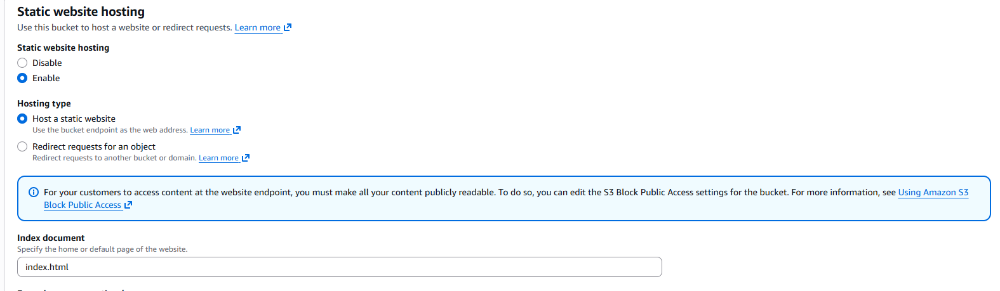
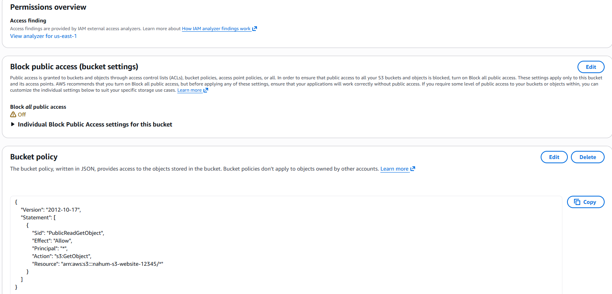

# AWS S3 Static Website Hosting Project

This project demonstrates how to host a static website using Amazon S3.  
I created an S3 bucket, configured public access, uploaded a simple HTML site, and enabled static website hosting.  
This project shows understanding of S3 permissions, bucket policies, and AWS console navigation.

---

## What This Project Does
- Hosts a static website using Amazon S3  
- Configures bucket permissions and public access settings  
- Uses an S3 bucket policy to allow public reads  
- Demonstrates how to upload and manage website files in S3  
- Shows how to test and verify the website endpoint  

---

## What I Learned
- How S3 buckets store and serve static content  
- How to enable and configure Static Website Hosting  
- How to fix common S3 errors such as:  
  - 403 Access Denied  
  - Public access blocked  
  - Incorrect bucket policy  
- How to structure a simple static website  
- How to verify the website using the S3 endpoint URL  

---

## Technologies Used
- Amazon S3  
- AWS Management Console  
- Bucket Policies (JSON)  
- Static Website Hosting  
- HTML  

---

## Screenshots

### 1. S3 Bucket List

### 2. Static Website Hosting Settings

### 3. Bucket Policy

### 4. Website in Browser

---

## Why This Project Matters
Static website hosting is one of the most common beginner AWS tasks.  
Cloud support engineers troubleshoot S3 issues every day, so this project demonstrates:  
- Understanding of AWS basics  
- Ability to fix real S3 errors  
- Ability to follow AWS documentation  
- Ability to build and verify cloud resources  

This is a strong portfolio project for anyone starting in cloud.
