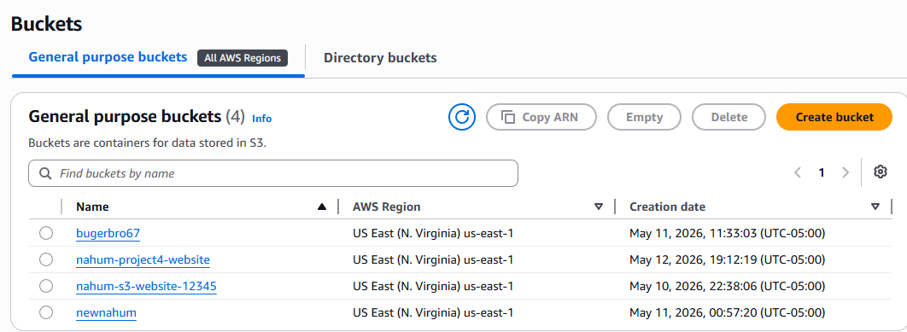

# AWS S3 Static Website Hosting

## Project Overview
This project shows how I hosted a simple static website using Amazon S3.  
I created a bucket, uploaded an index.html file, enabled static website hosting, and configured the bucket policy so the site could be accessed publicly.  
This is a common task in cloud support and helped me understand how S3 handles permissions and hosting.

## Architecture
User → S3 Website Endpoint → S3 Bucket

## Services Used
- Amazon S3  
- IAM (bucket policy)

## What I Did
- Created an S3 bucket  
- Turned off “Block Public Access”  
- Uploaded an index.html file  
- Enabled static website hosting  
- Added a public read bucket policy  
- Tested the website using the S3 endpoint  

## Example Bucket Policy
```json
{
  "Version": "2012-10-17",
  "Statement": [
    {
      "Sid": "PublicReadGetObject",
      "Effect": "Allow",
      "Principal": "*",
      "Action": "s3:GetObject",
      "Resource": "arn:aws:s3:::nahum-s3-website-12345/*"
    }
  ]
}
```

## What I Learned
- How S3 static hosting works  
- How bucket policies control access  
- How to fix common issues like 403 errors  
- How to deploy a basic website on AWS  

## Skills Demonstrated
- AWS S3  
- IAM permissions  
- Troubleshooting  
- Static website hosting  

## Next Steps
- Add a custom domain using Route 53  
- Add HTTPS using CloudFront  
- Build a more advanced static site  
- Automate deployment with AWS CLI or GitHub Actions  

## 📸 Screenshots

### 1. S3 Bucket List


### 2. Static Website Hosting Settings


### 3. Bucket Policy


### 4. Website in Browser

